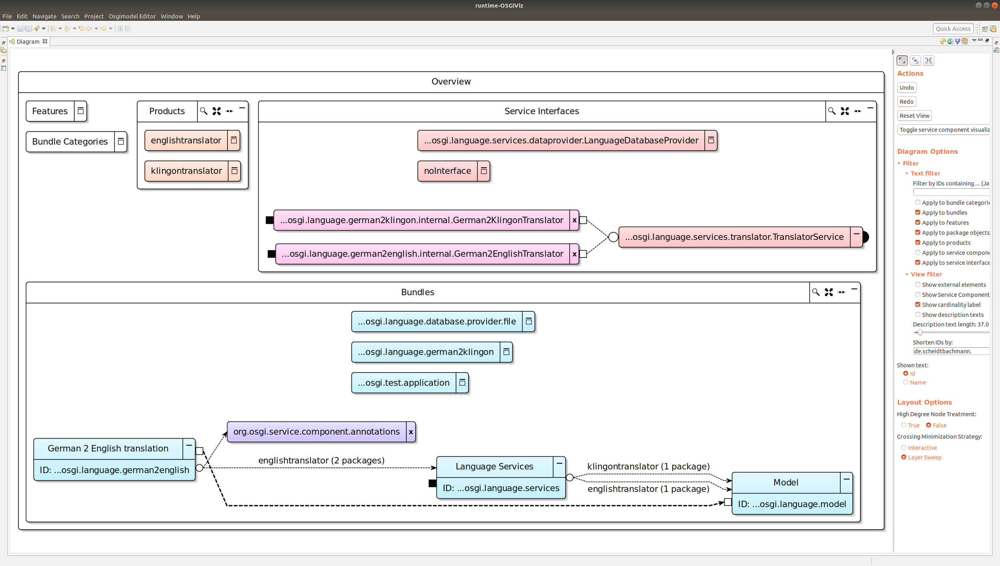

# osgiviz

osgiviz is a tool for automatic and interactive visualization and documentation of Java projects using the OSGi&trade; technology.
Read this paper for more details:

*Niklas Rentz, Christian Dams, and Reinhard von Hanxleden. "Interactive Visualization for OSGi-based Projects." 2020 Working Conference on Software Visualization (VISSOFT). IEEE, 2020.* [PDF](https://rtsys.informatik.uni-kiel.de/~biblio/downloads/papers/vissoft20.pdf)

It uses the KIELER Lightweight Diagrams (KLighD) framework
and provides a synthesis with interactivity
that can be used to display a diagram of an OSGi model file within Eclipse applications. 
Model files can be generated with the included model generator plugin
that currently works as a Maven mojo or a command line java executable for OSGi projects using PDE tooling. See [the generator readme](./plugins/de.scheidtbachmann.osgimodel.model.generate/readme.md) for more details.

## Installing osgiviz
This project can either be installed via the nightly update site for the latest updates or via the a release update site found at [https://github.com/kieler/osgiviz/releases](https://github.com/kieler/osgiviz/releases).
For the visualization you need to install features in Eclipse from two different update sites.
The visualization is available as defined in the release page or in the kieler/osgiviz nightly update site:

`http://rtsys.informatik.uni-kiel.de/~kieler/updatesite/nightly-openkieler/osgiviz/`

Together with that the *KIELER Lightweight Diagrams Generic Diagram View* feature from the KLighD update site needs to be installed to install the view showing the diagrams:

`https://kieler.github.io/KLighD/v1.1.1/`

These can be installed in Eclipse via the *Help -> Install new Software* menu.

To view the diagram of a model,
open said model with the now-installed *Sample Ecore Model Editor* of EMF
and open the diagram view via *Window -> Show view -> Other... -> KIELER Lightweight Diagrams -> Diagram*.

## The OSGi models
To generate a model file visualizable with osgiviz, have a look at the readme in the [osgimodel.model.generate bundle](https://github.com/OpenKieler/osgiviz/tree/master/plugins/de.scheidtbachmann.osgimodel.model.generate).
